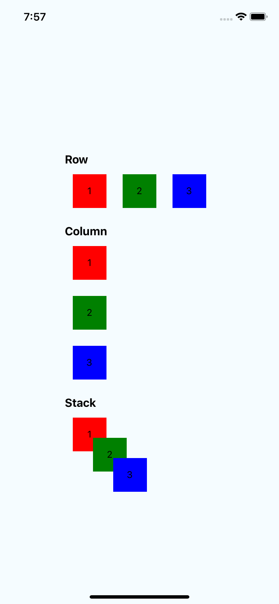
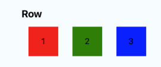
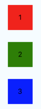
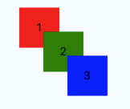

# react-native-simple-layout

A simple Semantic layout for react-native layout.



## Install

###### use yarn

```shell
yarn add react-native-simple-layout
```

###### use npm

```shell
npm i react-native-simple-layout
```

## Example

```typescript
function RectList() {
  return (
    <>
      <Rect text={1} style={{ backgroundColor: 'red' }} />
      <Rect text={2} style={{ backgroundColor: 'green' }} />
      <Rect text={3} style={{ backgroundColor: 'blue' }} />
    </>
  );
}
```

### Row



```typescript
function RowExample() {
  return (
    <Row>
    	<RectList />
    </Row>
  );
}
```

### Column



```typescript
function ColumnExample() {
  return (
    <Column>
    	<RectList />
    </Column>
  );
}
```

### Stack



```typescript
function StackExample() {
  return (
    <Row>
      <Rect text={1} />
      <Stack style={{ left: 30, top: 30 }}>
        <Rect text={2} style={{ backgroundColor: 'green' }} />
        <Stack style={{ left: 30, top: 30 }}>
          <Rect text={3} style={{ backgroundColor: 'blue' }} />
        </Stack>
      </Stack>
    </Row>
  );
}
```